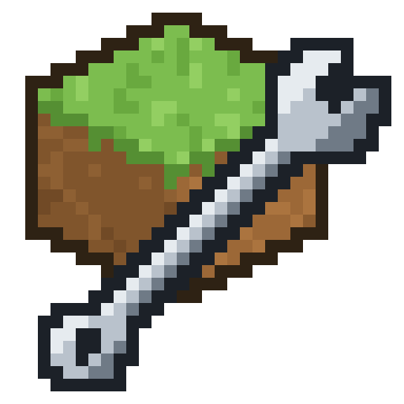

# MCP Toolkit



One mod jar (Fabric and NeoForge, dev and production) that opens a localhost HTTP bridge into the
running game and registers tools on it. Through `../mcp-server/`, any MCP client drives those tools:
read the world, edit it transactionally, push assets and data live, hotswap classes, stage entities
from Blockbench, author screens as documents, capture and place structures, preview worldgen, and
run authoring loops at scale. Toolkit 0.145.0, mcp-server 0.73.0, convention plugin 0.7.0.

The bridge binds `127.0.0.1` only and is on automatically in Gradle dev runs (`ping` reports the
port). Any local process can drive the game: that is the trust model, and there is no permission
system behind it.

**License** (`../LICENSE`, and `META-INF/LICENSE` inside the jar). **Free for non-commercial use**
- playing, learning, teaching, research, hobby modding, and building things you give away - with
no fee and nobody to ask. Within that use **anything you author is entirely yours**: the license
places no condition on your mods, assets, data or worlds, and makes no claim on them. Read and
fork the source freely.

Two things it does ask.

- **Commercial use needs permission first.** Use by or for a business, use in making anything you
  sell or offer for payment, use in paid work or a paid service. That is a door, not a wall -
  say what you want to do and ask. Ask before you start rather than after.
- **Do not redistribute the jar or the server.** Not to a mod site, a mirror, a modpack or a
  registry: link people to https://github.com/mattjesmc/MMCP instead, so what they download is
  what was actually released, at the version it claims to be. A modified version that adds real
  new capability you may pass on, named so it is not mistaken for this one and under these same
  terms.

If you are unsure which side of a line you are on, that is a question and not a verdict - ask.

## Install

Two prerequisites: **JDK 25** and **Node 18 or newer**. Then one of three paths.

In the game itself the jar needs **Fabric Loader 0.19.3+** (or NeoForge) and nothing else: **fabric-api
is not a dependency** - `fabric.mod.json` declares only the loader, Minecraft and Java, and the
`hooks/` + `mixin/` layer replaces the 14 fabric-api facilities the toolkit used to call. It also
does not mind fabric-api being there, which is the case every consumer mod is: the two take different
doors into the registries and both are exercised (`ARCHITECTURE.md`, "The toolkit needs no
fabric-api"; `RELEASE.md` 2.7 for how deeply each door has been tested).

**A new mod.** Copy `../template-mod/` (a minimal 26.2 Fabric mod with one scaffolded block, the
toolkit's convention plugin, and MCP registrations for Claude Code, Cursor, Gemini CLI, VS Code and
Codex). Rename it, pick a port in its `gradle.properties`, run `gradlew toolkitInit -Pclients=all`,
then `gradlew runClient`. Its README has the five steps.

**An existing mod.** Apply the convention plugin (`id 'com.mattmc.mcmod' version '0.7.0'` after
Loom in `build.gradle`; the `pluginManagement` block in `../template-mod/settings.gradle` says where
it resolves from), set `mcmod.port` in `gradle.properties` to a port no other dev game on the
machine uses, and run:

```
gradlew toolkitInit -Pclients=all     # registrations from that port, AGENTS.md, .mcptoolkit/loop.json,
                                      # the MCP server extracted from the jar into .mcptoolkit/mcp-server
gradlew runClient                     # the bridge is on that port; call `ping` first
```

`toolkitInit` writes each file once and never rewrites yours; a registration that names another
port is corrected and the correction reported; `-Ptoolkit.check` reports instead of writing. It also
writes the three Blockbench plugins into `.mcptoolkit/blockbench/` (they are bundled in the jar; the
dev boot refreshes its own copy under `<gameDir>/mcptoolkit/blockbench/`, and `LIVE_MODDING.md`'s
Blockbench link says which to load). The plugin also gives the repository `scaffold` (a block or item
into the source tree, once) and `checkAssets` (under `check`).

**This workbench.** `cd mcp-toolkit && ./gradlew runClient` starts the toolkit's own dev client
(bridge 25599); `../mcp-server` is the MCP server every repository here registers by absolute
path. After a structural Java change run `../tools/rebuild.ps1`; never `gradlew build` while the
game is running.

**Where the jar and the plugin come from.** Release 1 is served from a static Maven (a `maven`
branch of this repository served by GitHub Pages, plus a GitHub Release of the jar for a production
`mods/` folder) - `gradlew publishAllPublicationsToStaticRepository -Pmaven_repo=<checkout>` in
`mcp-toolkit/` and `gradle-conventions/` writes it. Until that branch is pushed, both resolve from
mavenLocal: `gradlew build` once in each of those two directories publishes them there, which is
what the template's `settings.gradle` names today.

Off Windows: everything above except `launch_game` and `tools/rebuild.ps1`, which spawn the game
through PowerShell; run `gradlew runClient` yourself, and everything after `ping` is identical.

## Find your task

Read the row that matches, then only the document or section it names. Tool names are the
manifest's. A profile that hides a tool refuses with `profile_hidden` and names the `tool_surface`
call that widens it.

| Task | Read | Tools / entry |
|---|---|---|
| Get a change into the running game without restarting; pick the route by what changed | `LIVE_MODDING.md`: Decision table | `hotswap_class`, `push_asset`, `push_data`, `reload_resources`, `reload_data`, `get_log` |
| Start a block or item from nothing, then see it in the game | `LIVE_MODDING.md`: Before a game exists | `gradlew scaffold`, then `launch_game`, `query_registry`, `set_blocks`, `render` |
| Check a resources tree before any game loads it | `LIVE_MODDING.md`: Before a game exists | `gradlew checkAssets` (under `check`); a loop file's `checks[].run` |
| Find out why the game died, or why it never came up | `LIVE_MODDING.md`: The crash, read by the next game | `ping` (`last_crash`), `get_log {crash}`, `launch_game`'s exit-1 log |
| Know what the JVM, the registries, a loot table or the worldgen actually have | `LIVE_MODDING.md`: What a class ACTUALLY is; What is registered; What does it DROP; What will the WORLDGEN make | `query_class`, `query_registry`, `roll_loot`, `preview_worldgen` |
| Author a GUI screen: layout as a `.ui.json` document, in-game editor, generated Java | `LIVE_MODDING.md`: UI iteration loop; then `docs/screens/SCREEN_AUTHORING_DESIGN.md` sections 4, 7, 10 | `ui_doc`; in game Ctrl+G edit, Ctrl+U attach, Ctrl+S save and regenerate; `gradlew generateUi`, `checkUi`; profile `screens` |
| Reuse UI parts: frames, wells, slot grids, `part` and `repeat` macros | `docs/screens/UI_PARTS_LIBRARY_DESIGN.md` section 7; `src/main/resources/assets/mcptoolkit/ui/parts/README.md` | `ui_doc read` lists expansions |
| Drive or inspect any screen, vanilla or modded | `LIVE_MODDING.md`: UI iteration loop | `get_screen`, `screenshot_annotated`, `click`, `send_keys`, `check_layout` |
| Model, texture or animate an entity in Blockbench and see it stand in the game | `LIVE_MODDING.md`: Blockbench link; `docs/models/BLOCKBENCH_BRIDGE_DESIGN.md`; `docs/models/ENTITY_AUTHORING_DESIGN.md` section 2; `blockbench/README.md` | plugins `mcptoolkit_bridge.js` (the door), `mcptoolkit_entity.js`, `mcptoolkit_sync.js`; `stage_entity`; profile `art` |
| Render a model or scene to a picture; the camera; the studio dimension | `docs/models/RENDER_SEAM_DESIGN.md` sections 11-14 | `render`, `studio` |
| Build in the world, capture it as a structure, place it back | `LIVE_MODDING.md`: Structures; `docs/world/STRUCTURE_AUTHORING_DESIGN.md` sections 4, 6, 9 | `place_shapes`, `set_blocks`, `capture_structure`, `place_structure`, `undo_edit` |
| Iterate worldgen noise | `LIVE_MODDING.md`: What will the WORLDGEN make; `docs/world/WORLDGEN_ITERATION_DESIGN.md` | `preview_worldgen` |
| Promote a live-pack change into mod source | `LIVE_MODDING.md`: Promotion | `clear_assets` / `clear_data` with `promote`; Blockbench `target:'source'` |
| Author MANY units of one kind (parts, skins, screens, rooms) with a model, cheaply | `docs/guides/LOOPS.md`; then `tools/loop/` (agent template, `run-unit.ps1`, `analyse.mjs`) | `.mcptoolkit/loop.json`; `MCPTK_SHOT_MAX`; `paint_faces`, `paint_ascii` |
| Add your mod's own tools, or teach the toolkit about your modded data | `EXTENDING.md`: Quickstart; The contract; Modded data recognition | `McpToolkitEntrypoint` |
| Build an editor for your mod's content on the toolkit | `EXTENDING.md`: Building an editor on the toolkit | `run_command` first, a tool entry last |
| Queue something for a human to look at | `EXTENDING.md`: Asking a human; `ARCHITECTURE.md`: The review layer | `review_post`, `review_status`, `/review` in game |
| Start an agent session in YOUR mod repository, and tell it what to believe | `docs/guides/SESSION_CHARTER.md` (paste into the repo's `CLAUDE.md`) | `ping`, `launch_game`, `tool_surface` |
| Attach an agent client other than Claude Code | `docs/guides/ADAPTER.md` | `AgentClient` |
| Choose what a session sees (profiles) and what each tool costs per turn | `../mcp-server/README.md`: `MCPTK_PROFILE`; `docs/platform/TOOL_BILL_PLAN.md` section 4 | `MCPTK_PROFILE`, `tool_surface`, the `profile` block of `ping` |
| Ship on NeoForge, or attach to a production (launcher) game | `docs/platform/CROSS_LOADER_DESIGN.md` sections 12-16; `LIVE_MODDING.md`: Two working modes; Attaching to a normal game | `-Dmcptoolkit.port` |
| Several sessions on one game, headless companions, chat routing | `ARCHITECTURE.md`: Sessions; `docs/platform/COMPANION_REDESIGN.md` | `session_list`, `session_send`, `companion_spawn` |
| Write a test suite against a dedicated server: which tools answer headless, which build is answering | `docs/platform/HEADLESS.md` (generated); `LIVE_MODDING.md`: Driving a dedicated server | `ping` (`build`, `clientPresent`), the manifest's `context` column |
| Photograph a body wearing your equipment, deterministically; read a tooltip; a fresh world per run | `LIVE_MODDING.md`: studio entity, get_tooltip, create_world | `studio {entity, equipment, freeze}`, `render`, `get_tooltip`, `create_world` |
| Per-world agent memory | `docs/memory/MEMORY_DESIGN.md`; `../mcp-server/memory/README.md` | `mem_*` (served by the MCP server, not the mod) |
| Understand what the world reads return and why they are shaped that way | `ARCHITECTURE.md`: Perception; `docs/perception/` | `describe_box`, `get_surface`, `get_blocks_at`, `locate`, `check_*` |
| An agent that PLAYS: drone body, survival, combat (experimental) | `docs/README.md`: play; `ARCHITECTURE.md`: Action | profiles `play`, `survey`, `survival`; `bot_*` |
| Measure it: bench, ablations, the papers | `docs/bench/`; `../mcp-server/testbench/README.md` | `npm run test:ablation` |
| Test it | `../mcp-server/README.md`; `../tools/README.md` | `npm test` (offline), `../tools/battery.ps1` (live, sequential), `./gradlew test` |
| What is owed, what was decided, what changed in which version | `RELEASE.md` (the ledger the release was cut from: what ships, what is verified, what is open); `CHANGELOG.md` (one section per version, newest first). The work lists `RELEASE_1.md` and `TODO.md` are in the workbench archive and leave a stub each, because the tree cites their section numbers in 125 places | - |
| What ships, what was verified on it, what is left before release 1 | `RELEASE.md`: the verification ledger, the human queue, the build-or-descope table | - |

## This directory

- `src/main/java/com/mattmc/mcptoolkit/` - the mod. The top-level `*Tools.java` files register the
  tools; `ui/` is the screen compiler, interpreter and editor; `drone/` and `nav/` the body;
  `agent/` the agent-client adapters and kits; `preview/` the render studio; `review/` the
  owed-human-test queue; `platform/` and `fabric/` the loader seams; `wm/` the experimental world
  model.
- `src/main/resources/mcptoolkit/` - the files the production extract writes into a game directory,
  and the UI emitter's templates.
- `blockbench/` - the three Blockbench plugins (the bridge, sync, entity) and their fixtures.
- `tools/loop/` - the project-side files of the loop kit.
- `docs/` - every design record, one directory per subject; `docs/README.md` is the index.
- `build.gradle` - the build. `CHANGELOG.md` - one section per toolkit version, newest first (it was
  this file's 2,400-line comment block until 2026-09-06).

## Reading the documents

- The three manuals live here: `LIVE_MODDING.md` (workflow), `EXTENDING.md` (API),
  `ARCHITECTURE.md` (vocabulary and decisions). `RELEASE.md` is the release ledger; the plan it
  was cut from (`RELEASE_1.md`) and the backlog beside it (`TODO.md`) are in the workbench's
  private archive, each leaving a stub here so the section numbers this tree cites still resolve.
- Everything under `docs/` is a design record: thesis first, "as built" and "tested" sections at
  the end, dated. Read the last dated section before the thesis.
- Cross-references are bare filenames with a section number. Record names are unique across the
  tree, so search by name.
- The manifest is the truth about tools (`GET /tools` on the bridge, or `tool_surface`); every
  table in a document is a summary of it.
